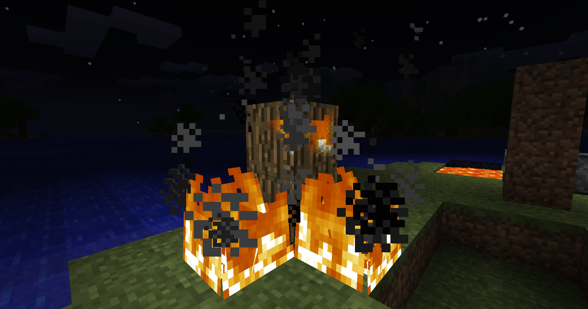
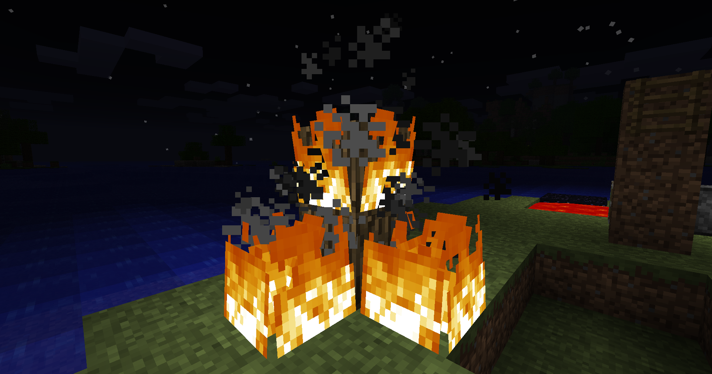
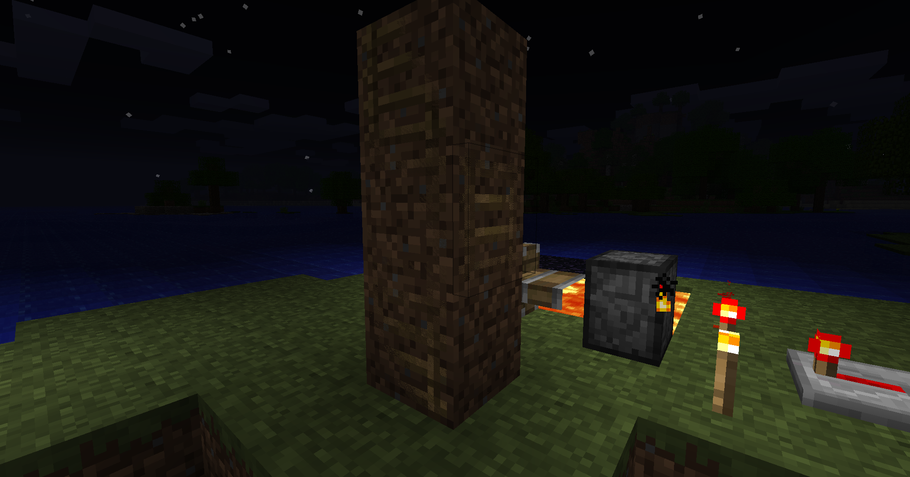
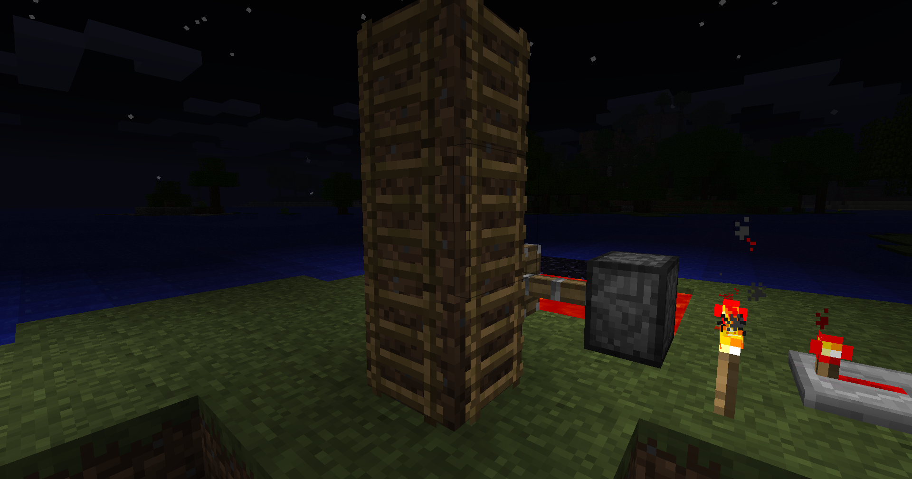
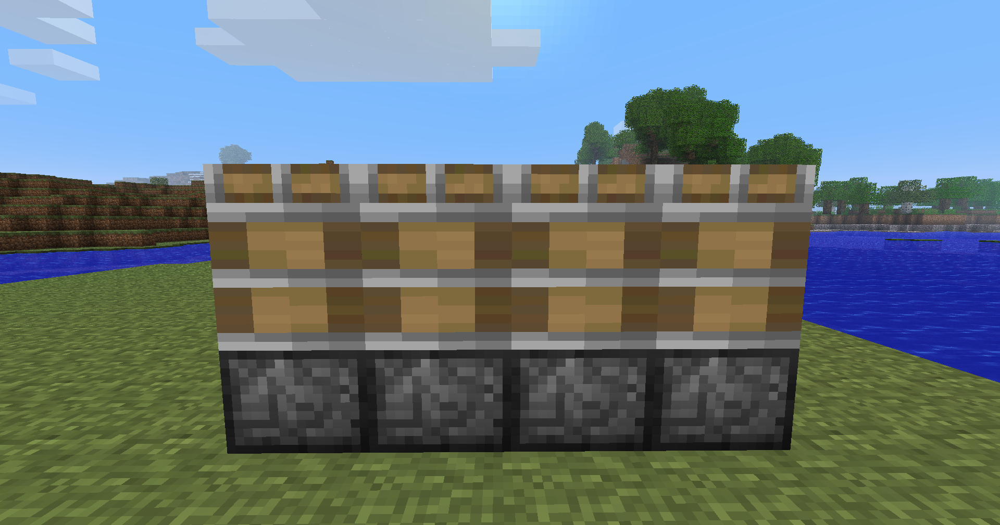
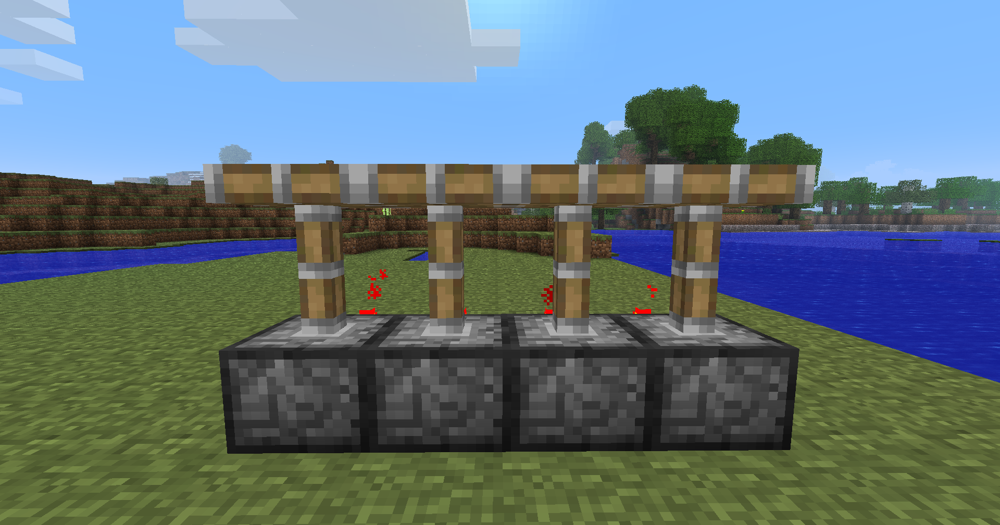
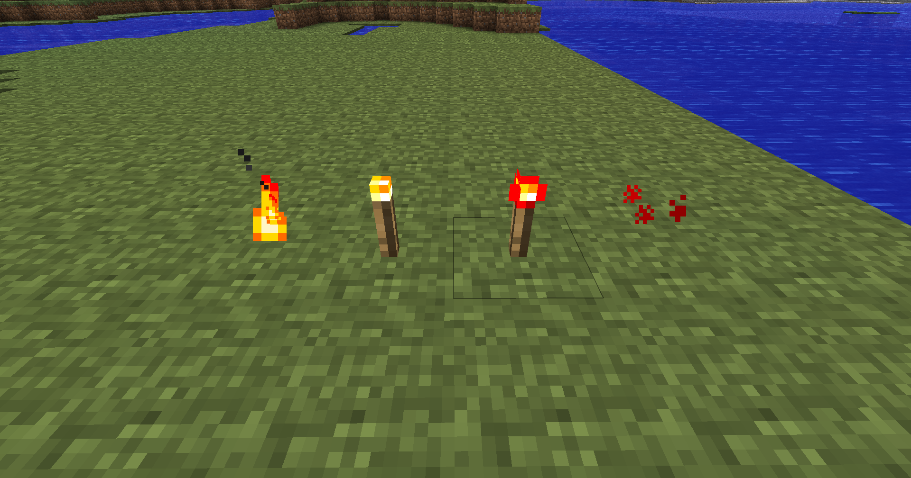
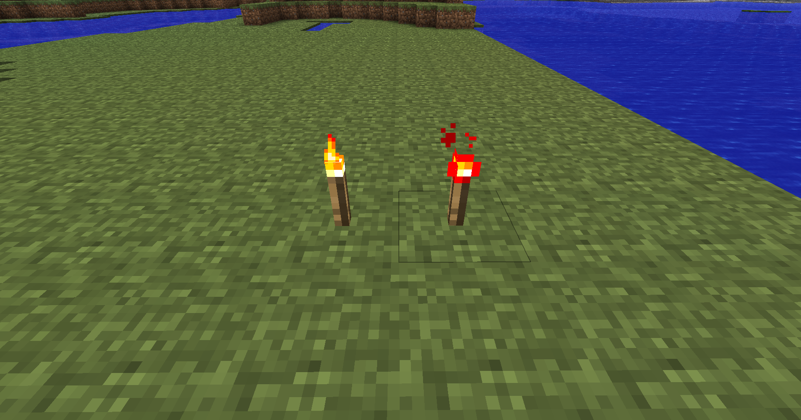

# Jitter-Fix
Fixes jitter when you are far away from the world orgin. Aswell as many other rendering issues when far away from the world orgin. 
 
### Things that it fixes
- Ladder Z Fighting
- Fire Z Fighting
- Redstone/Normal torches particles being off center
- Redstone repeater torches particles being off center
- Furnace particles being off center
- Pistons head being bigger then normal

<table>
  <tr>
    <th>Before</th>
    <th>After</th>
  </tr>
  <tr>
    <td></td>
    <td></td>
  </tr>
  <tr>
    <td></td>
    <td></td>
  </tr>
  <tr>
    <td></td>
    <td></td>
  </tr>
  <tr>
    <td></td>
    <td></td>
  </tr>
</table>